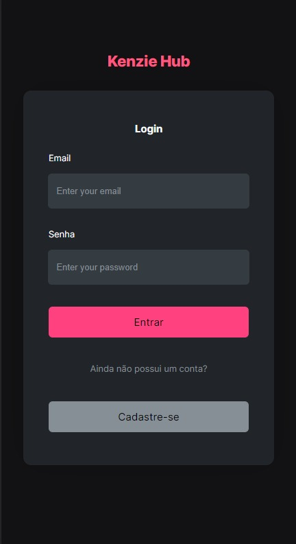

# Kenzie Hub

## Sobre:

Kenziehub é um hub de portfólios de programadores da Kenzie! O objetivo dessa aplicação é conseguir criar um frontend de qualidade, utilizando o que foi ensinado, até o momento, no terceiro módulo do curso (M3).

Nesta aplicação o usuário poderá se cadastrar, adicionar as tecnologias que ele aprendeu e está aprendendo, assim como seus trabalhos realizados.

Este projeto foi criado com [Create React App](https://github.com/facebook/create-react-app).

#

</a> 
</a>

## 📜 Prévia:

<h3>
&nbsp;&nbsp;&nbsp;&nbsp;
</h3>

## 📲 Teste o [projeto](https://react-entrega-s2-kenzie-hub-fabiojcp.vercel.app/).

 

## 🚀 **Tecnologias**  

- [Axios](https://github.com/axios/axios)
- [Hook Form](https://react-hook-form.com/)
- [Hookforn Resolvers](https://github.com/react-hook-form/resolvers)
- [React Router dom](https://reactrouter.com/docs/en/v6/getting-started/overview)
- [Styled Components](https://www.styled-components.com/)
- [Eslint](https://eslint.org/)
- [Toastify](https://github.com/fkhadra/react-toastify#readme)
- [Yup](https://github.com/jquense/yup)
- [Standard Version](https://github.com/conventional-changelog/standard-version)
- [React Icons](https://react-icons.github.io/react-icons/)
- [react-password-strength-bar](https://github.com/lannex/react-password-strength-bar)
- [framer-motion](https://github.com/framer/motion)

## 🗣️ Fale comigo!

- [Linkedin](https://www.linkedin.com/in/f%C3%A1bio-casanova-baa818237/)

#
